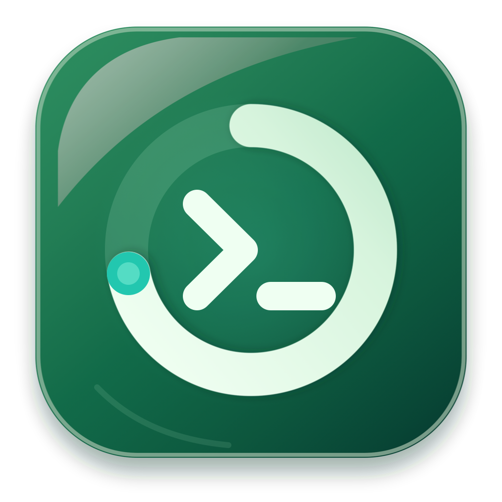
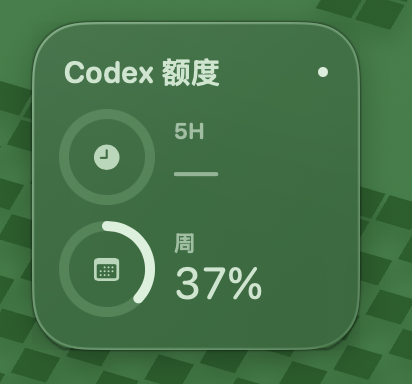

<p align="center">
  
</p>

<h1 align="center">Codex Quota Widget for macOS</h1>

<p align="center">
  A compact frosted-glass desktop widget that shows your local Codex 5-hour and weekly usage quotas.
</p>

<p align="center">
  <a href="https://github.com/GGGGx-3162/codex-quota-widget/releases/latest">Download the latest DMG</a>
  ·
  <a href="#中文说明">中文说明</a>
</p>

<p align="center">
  
</p>

## Features

- Native SwiftUI macOS app with a translucent frosted-glass design.
- Shows remaining 5-hour and weekly Codex quota as circular gauges.
- Refreshes immediately at launch and every 30 seconds afterward.
- Chinese and English interface switching from the right-click menu.
- Optional always-on-top mode and reliable Launch at Login support.
- Menu bar controls for showing, refreshing, or quitting the widget.
- Fully local and read-only: no API key, account password, or network request.

## Requirements

- macOS 14 Sonoma or later.
- The Codex desktop app or CLI must have written recent usage events locally.

## Install

1. Download `Codex-Quota-Widget-1.3.1.dmg` from [Releases](https://github.com/GGGGx-3162/codex-quota-widget/releases/latest).
2. Open the DMG and drag **Codex 额度** to **Applications**.
3. Launch the app, then drag the widget anywhere on the desktop.

The current community build is ad-hoc signed and is not notarized with an Apple Developer ID. On first launch, macOS may require you to Control-click the app, choose **Open**, and confirm.

## Usage

- Drag the widget background to move it.
- Right-click to refresh, toggle always-on-top, enable Launch at Login, switch language, open Codex, or quit.
- Use the menu bar gauge icon to restore the widget if it is covered or closed.
- `—` means Codex has not recently written a usable record for that quota window.

## Privacy

The app only reads rate-limit events from:

```text
~/.codex/sessions/**/*.jsonl
```

It filters for the main `codex` quota pool. It does not upload session contents, make network requests, or request an API key.

## Build from source

Install Xcode Command Line Tools, then run:

```bash
./scripts/build-app.sh
open build/CodexGauge.app
```

The generated app is written to `build/CodexGauge.app`. To select a specific macOS SDK, set `CODEX_GAUGE_SDKROOT` before running the build script.

Run the quota parser regression check with:

```bash
SDKROOT="$(xcrun --sdk macosx --show-sdk-path)" \
swiftc -parse-as-library \
  Sources/CodexGauge/UsageModels.swift \
  Sources/CodexGauge/CodexUsageReader.swift \
  scripts/verify-reader.swift \
  -o /tmp/codex-gauge-verify
/tmp/codex-gauge-verify
```

## Limitations

- Codex does not always write both quota windows at the same time, so one gauge may temporarily show `—`.
- The local Codex session-log format is not a public compatibility contract and may change in future Codex releases.
- This is an independent community project and is not an official OpenAI product.

## License

[MIT](LICENSE)

---

## 中文说明

Codex 额度是一个原生 macOS 磨砂玻璃桌面小组件，用于显示本机 Codex 的 5 小时额度与每周额度。

主要功能：

- 启动时立即读取，此后每 30 秒刷新。
- 右键切换中文和 English，设置会自动保存。
- 支持保持在最前、登录时自动启动和菜单栏控制。
- 所有数据只在本机只读处理，不需要 API Key，也不会上传会话内容。

安装方法：从 [Releases](https://github.com/GGGGx-3162/codex-quota-widget/releases/latest) 下载 DMG，打开后将 **Codex 额度** 拖入“应用程序”。当前版本未经过 Apple Developer ID 公证，首次启动时可能需要按住 Control 点击应用并选择“打开”。
